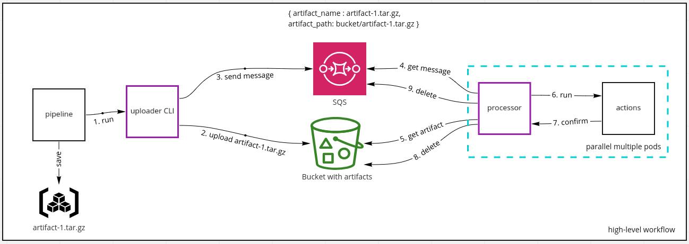
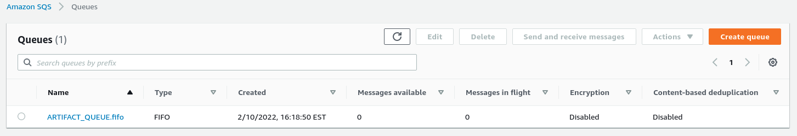
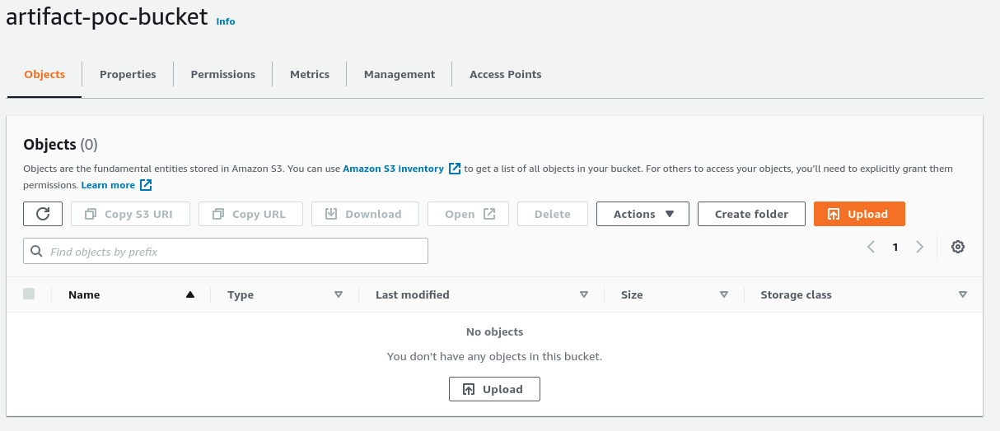
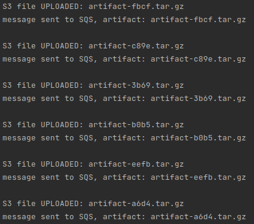
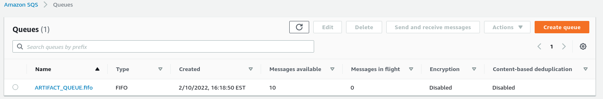
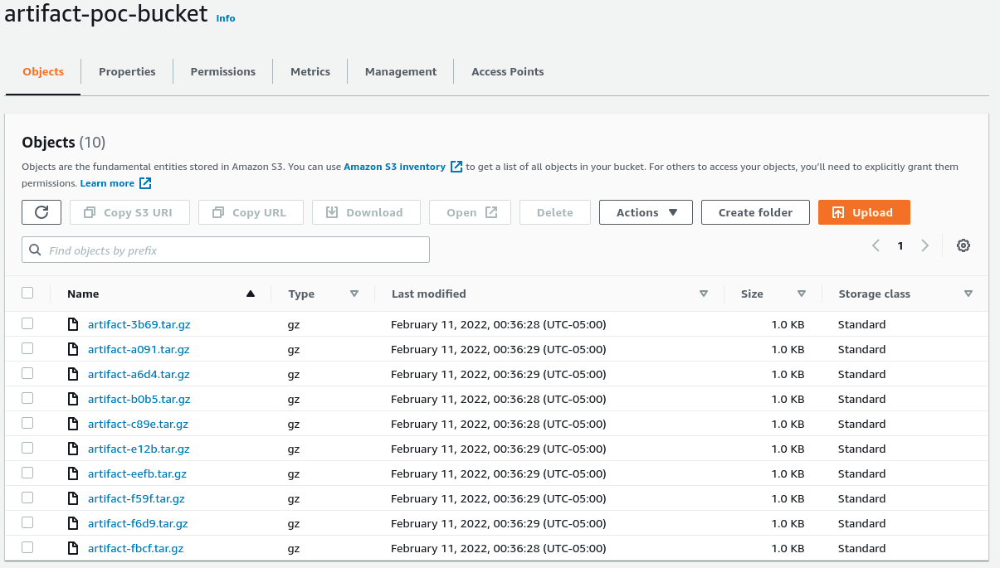
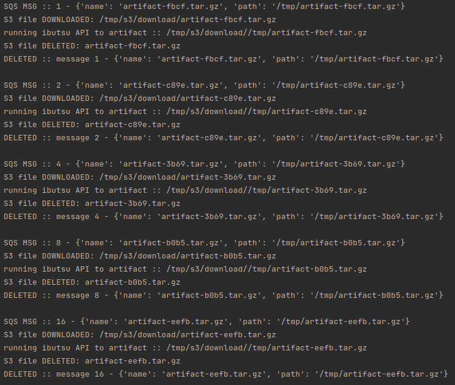

# s3-pull-processor

This project is a POC, proof of concept for client to upload pipeline artifacts to an object storage as S3 and able
to consume the artifacts efficiently. The consumer must be scalable.

The diagram below represents a high-level workflow, the boxes `uploader CLI` and `processor` are the components here
being implemented.

The infra needed to run this POC is basically [AWS S3](https://aws.amazon.com/s3/) and
[AWS SQS](https://aws.amazon.com/sqs/).

See [developer guide](doc/developer_guide.md) for instructions to run or to contribute

# demo

The items 1 to 5 below, show an e2e execution from uploader to processor or consumer.

1. SQS and S3 are empty, no messages and no files

    
    

2. simulating a `HOST A` where the artifact exist and need to be uploaded to S3, also a message is sent to SQS.
For this step the code [test_host_producer](test/test_e2e.py) was executed:

    

3. check there are messages in SQS and files in S3

    
    

5. simulating a `HOST B` where it consumes messages from SQS and for each message download the artifact from S3,
run an action on this case it run [import_to_ibutsu](s3_pull_processor/actions.py) action then delete the file
from S3 and finally delete the message from SQS. For this step the code [test_host_consumer](test/test_e2e.py) was executed

    

Also see [scenarios](doc/developer_guide.md#scenarios) in developer guide.

## links
* [miro diagram](https://miro.com/app/board/uXjVOOPt_g4=/)
* [SQS](https://docs.aws.amazon.com/AWSSimpleQueueService/latest/SQSDeveloperGuide/sqs-using-send-message-with-attributes.html)
* [AWS SQS console](https://us-east-2.console.aws.amazon.com/sqs/v2/home?region=us-east-2#/queues)
* [AWS S3 console](https://s3.console.aws.amazon.com/s3/buckets/artifact-poc-bucket?region=us-east-2&tab=objects)
