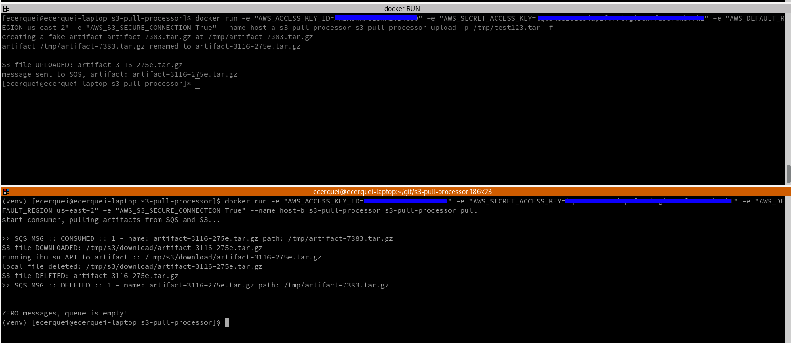

# container

```shell
# build container
sh ops/scripts/container_image_build.sh

# run container with no arguments
docker run --name poc-s3 s3-pull-processor
```

A new container image is automatically build when a new package version is released. The container image is available
in [ghcr.io/eduardocerqueira/s3-pull-processor:latest](ghcr.io/eduardocerqueira/s3-pull-processor:latest)

```shell
# pull latest container image
 docker pull ghcr.io/eduardocerqueira/s3-pull-processor:latest
```

see s3-pull-processor running in [k8s/Openshift](openshift.md)

## example

Simulating HOST-A uploading artifact data to S3, and HOST-B pulling data from S3 and SQS and processing it.

Notice the argument `-f` passed to the command to run on the HOST-A, it is to create a fake artifact file for test

```shell
# HOST-A
docker run -e "AWS_ACCESS_KEY_ID=*************" \
-e "AWS_SECRET_ACCESS_KEY=*************" \
-e "AWS_DEFAULT_REGION=*************" \
-e "AWS_S3_SECURE_CONNECTION=*************" \
--name host-a s3-pull-processor s3-pull-processor upload -p /tmp/fake-artifact-file.tar -f

# HOST-B
docker run -e "AWS_ACCESS_KEY_ID=*************" \
-e "AWS_SECRET_ACCESS_KEY=*************" \
-e "AWS_DEFAULT_REGION=*************" \
-e "AWS_S3_SECURE_CONNECTION=*************" \
--name host-b s3-pull-processor s3-pull-processor pull
```




# links
[ghcr.io](https://docs.github.com/en/packages/working-with-a-github-packages-registry/working-with-the-container-registry)
