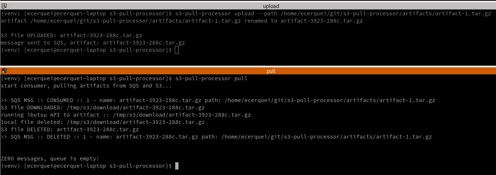
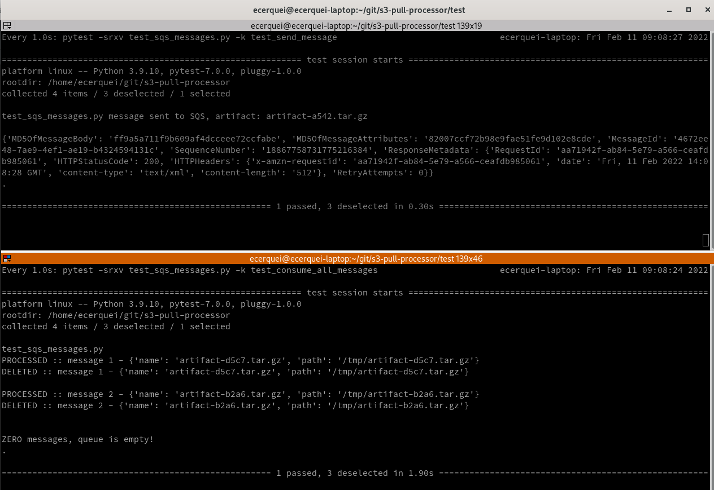
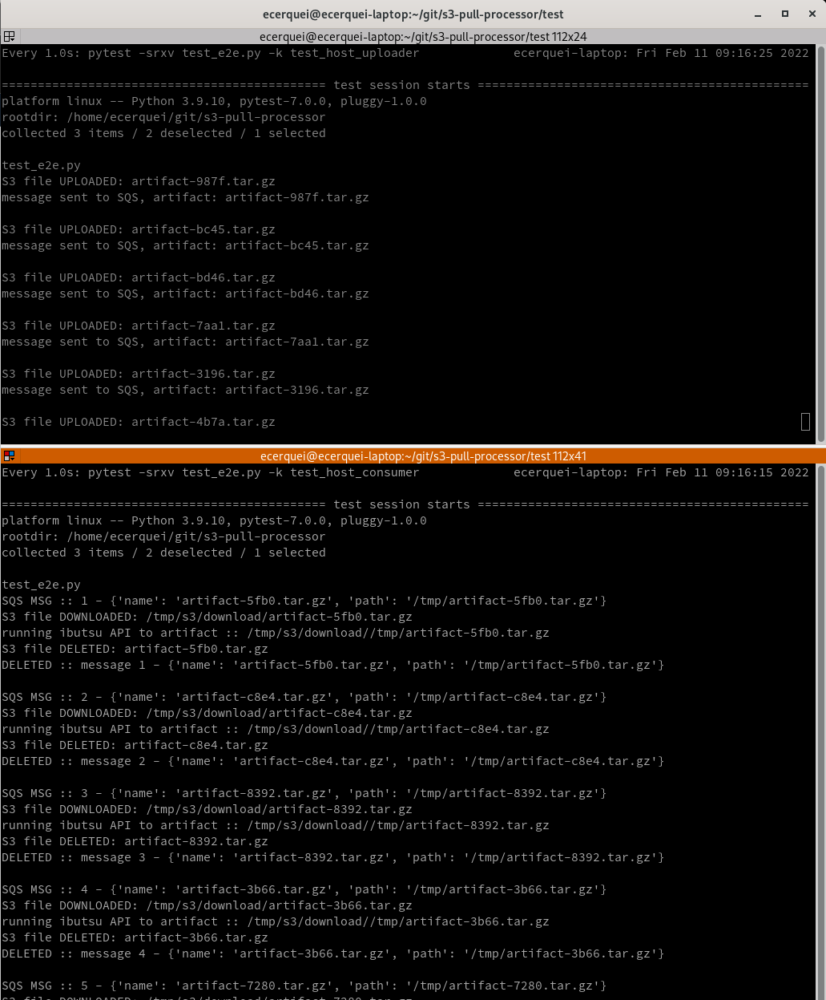

# developer guide

## install

run the script below to install the program in a consistent way:

```shell
sh ops/scripts/install.sh
```

afterwards, if you want  dev environment:

```shell
pip install --editable .[dev]
```

This project is also available in [pypi](https://pypi.org/project/s3-pull-processor/)

```shell
# installing latest version from https://pypi.org/project/s3-pull-processor/
pip install s3-pull-processor
```

Also, there is container image available, check more info and how to use in [container mode](container.md)

```shell
# pull latest container image
 docker pull ghcr.io/eduardocerqueira/s3-pull-processor:latest
```

see s3-pull-processor running in [k8s/Openshift](openshift.md)

## pre-requisite

export AWS variables

```shell
export AWS_ACCESS_KEY_ID=**************
export AWS_SECRET_ACCESS_KEY==**************
export AWS_DEFAULT_REGION==**************
export AWS_S3_SECURE_CONNECTION==**************
```

## run

follow steps from [pre-requisite](developer_guide.md#pre-requisite)

```shell
# generate some fake artifacts for development
sh ops/scripts/artifact_generator.sh

# upload artifact
s3-pull-processor upload --path /home/ecerquei/git/s3-pull-processor/artifacts/artifact-1.tar.gz

# pull artifacts
s3-pull-processor pull
```



you also can run using containers, follow the instructions at [container example](container.md#example)

## running tests

follow steps from [pre-requisite](developer_guide.md#pre-requisite)

```shell
# SQS message tests
pytest -srxv test_sqs_messages.py

# S3 bucket tests
pytest -srxv test_s3_files.py

# E2E
pytest -srxv test_e2e.py

# wipe out S3 and SQS, helpful for development
pytest -srxv test_wipe_out.py
```

## debug

see [configuring pycharm for debug](debug.md)

### TDD Scenarios

#### Two hosts exchanging SQS messages, producer and consumer

HOST A sends messages and HOST B consume messages from SQS

```shell
# terminal 1
watch -n 1 "pytest -srxv test_sqs_messages.py -k test_send_message"

# terminal 2
watch -n 1 "pytest -srxv test_sqs_messages.py -k test_consume_all_messages"
```



#### e2e simulation S3 artifact and SQS messages exchanged between two hosts, producer and consumer

HOST A upload artifact to S3 and sends messages to SQS, HOST B consuming it asynchronously

```shell
# terminal 1
watch -n 1 "pytest -srxv test_e2e.py -k test_host_producer"

# terminal 2
watch -n 1 "pytest -srxv test_e2e.py -k test_host_consumer"
```



## release

see [release doc](release.md)

## contributing

before commit any code, run lint, it is required to have [dev](../setup.cfg) packages installed

```shell
pre-commit run --all
```
