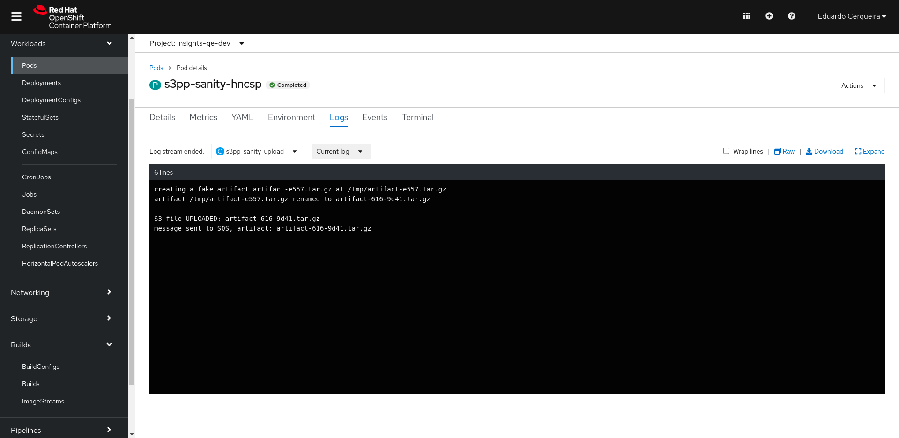
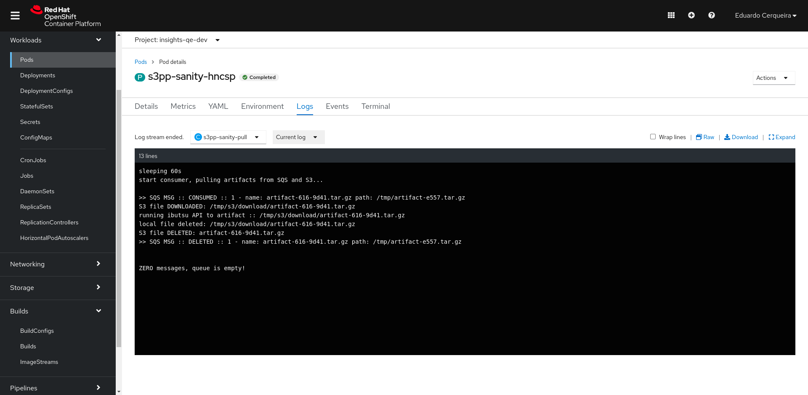

# openshift

## pre-requisites

* OCP access
* OCP secrets

see k8s/ocp files descriptor at [ops/ocp/*.yaml](../ops/ocp)

```shell
oc apply -f ops/is.yaml
oc apply -f ops/dc.yaml
```

jobs

```shell
# sanity job, run once
oc apply -f ops/job_sanity.yaml

# cron
oc apply -f ops/job_cron.yaml
```

screenshot for s3-pull-processor running in OCP:




